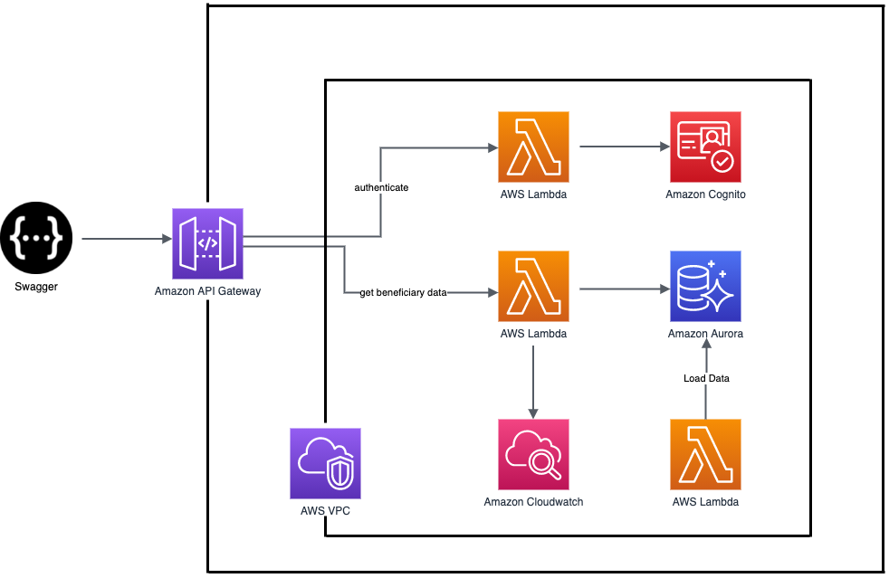
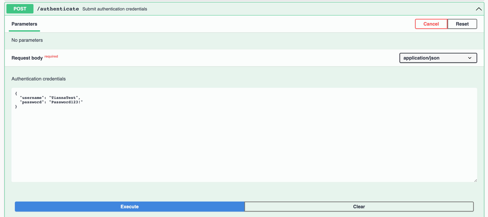
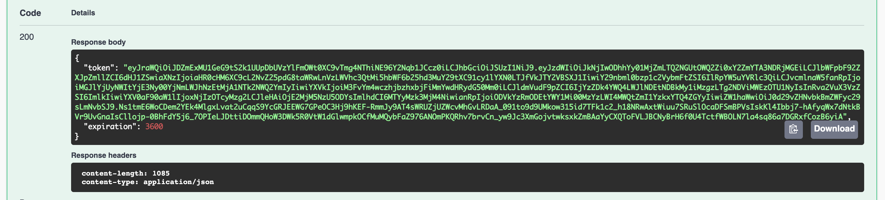
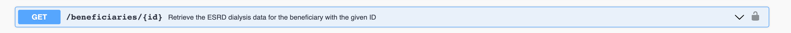
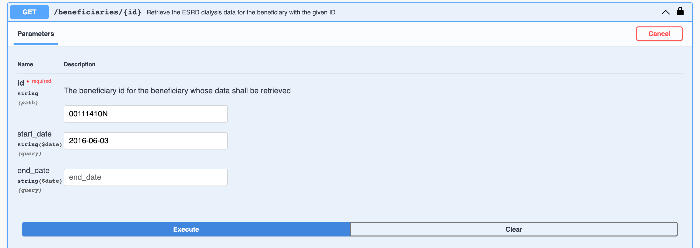
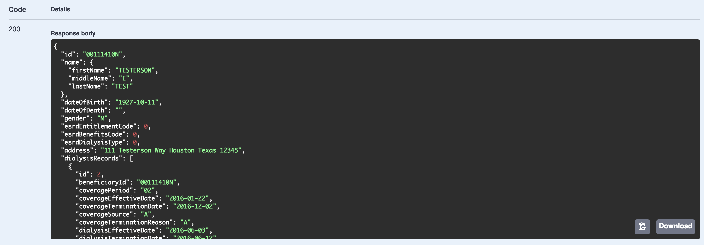

# Fearless Proposal Platform 
The Fearless Proposal Platform is a Modular Sandbox of features for automatically spinning up environments. 

#### Platform to provide easy-to-use serverless rapid prototyping infrastructure that is easily forkable for use.

[Table of Contents](#table-of-contents)
  * [Context](#context)
    + [Out of the Box Solution](#out-of-the-box-solution)
  * [Customize the Repository](#customize-the-repository-for-a-new-use)
  * [Running Locally](#running-Locally)
    + [Prerequisites](#prerequisites)
    + [Build and run services defined in the docker-compose.yml](#build-and-run-services-defined-in-the-docker-compose.yml)
    + [Bashing into the Python container](#bashing-into-the-python-container)
    + [React app commands](#react-app-commands-from-the-react-app-directory)
    + [Automated Tests and Linting](#automated-tests-and-linting)
    + [Deploying](#deploying)
      + [Spinning up Basic Infrastructure](#spinning-up-basic-infrastructure)
      + [Spinning up Python Lambdas](#spinning-up-python-lambdas)
  * [Architecture](#architecture)
    + [Tools](#tools)
  * [Continuous Integration / Continuous Deployment (CI/CD)](#continuous-integration--continuous-deployment-cicd)
  * [Swagger Client](#swagger-client)
    * [Initial Data Load](#initial-data-load)
    * [Initial Authentication](#initial-authentication)
    * [Retrieving Beneficiary Data](#retrieving-beneficiary-data)
  * [Future Improvements](#future-improvements)

## Context
In order to rapidly create working prototypes to respond to technical challenges, Fearless needs to have a platform that can be easily forked/copied so that a challenge team can hit the ground running and start development ASAP.

### Out of the Box Solution
This platform is designed to minimize the amount of up front work needed to allow developers to write the first line of code that contains business logic. This drives the tools in use on AWS, all of which are serverless:
- API Gateway is used to receive HTTP requests
- Lambdas receive the HTTP requests from API Gateway and process them
- AWS Cognito is used to store and authenticate users
- AWS Aurora is used as the database
- Cloudfront and S3 are used to host the React front end

You can see these tools in use here:
- Building a simple React front-end to interact with the Benficiary API
- Building a simple specification for API Gateway using [OpenAPI](docs/openapi.yml)
- Creating an AWS Cognito Pool to authenticate users and provide encyrpted JWTs
- Configuring AWS API Gateway to require JWT headers for all incoming requests and validating those JWTs
- Configuring an AWS Aurora instance to host sample beneficiary data based on the sample [database schema](visualizations/schema.png)
- Creating a [Lambda](python_lambda/data_load_lambda.py) to parse and load the sample beneficiary data to the database
- Creating a [Lambda](python_lambda/get_beneficiary_data.py) to parse requests and pull data from Aurora approproately while logging all requests to CloudWatch
- Creating a [Swagger client](https://fearlesssolutions.github.io/fearless-proposal-platform/) to post to the API to demonstrate available tools to ease onboarding

## Related 
The [OCR Demo](https://github.com/FearlessFarms/ocrdemo) Implementation of the modular serverless architecture, built in  in React.

## Customize the Repository for a New Use
1. Clone repo from GitHub
1. Decide what AWS account the resources will live in and set up your AWS CLI credentials appropriately (see [Prerequisites](#prerequisites-for-local-development) for help)
1. Customize your namespace for the AWS resources. The current namespace is specified using the `fms` prefix. Make sure you update your chosen namespace in the following files:
    - [terraform/variables.tf](terraform/variables.tf)
    - [terraform/backend.tf](terraform/backend.tf)
    - [python_lambda/terraform/variables.tf](python_lambda/terraform/variables.tf)
    - [python_lambda/terraform/backend.tf](python_lambda/terraform/backend.tf)
1. Push to a new repository
1. Continue to make any desired code customizations/additions

## Running Locally

### Prerequisites
- You will need to have [Docker](https://docs.docker.com/get-docker/) and [Docker Compose](https://docs.docker.com/compose/install/) installed in order to do local development.
- During initial setup of this project, you will need to run `npm install` in the [react-app](react-app) directory. *This is done to create the `node_modules` directory which is referenced by the react-app's [Dockerfile](react-app/Dockerfile)*
- In order to run terraform commands, you will need the following:
  - Install [Terraform](https://www.terraform.io/)
  - Install [AWS CLI](https://docs.aws.amazon.com/cli/latest/userguide/cli-chap-install.html)
    - Set up access keys for AWS CLI usage from the Fearless Farms AWS Account (or account of your choice)
      - If using the Fearless Farms AWS Account (IT may need to grant you access), it can be accessed via [OneLogin](https://fearless.onelogin.com/portal) and clicking on Amazon Web Services. Then you can select the role that is associated with the `fearless-farms-dev` account.
      - You may need to create a new user in IAM > Users (unless you have an existing user)
        - Want user to have **Programmatic access** (Enables an access key ID and secret access key for the AWS API, CLI, SDK, and other development tools)
      - run `aws configure --profile fearless-farms` (can replace fearless-farms with a profile name of your choice) in order to set the aws credentials
        - Tip: run `cat ~/.aws/credentials` to ensure you set the correct credentials and `cat ~/.aws/config` to check your config. Sample output:
        ```
        [fearless-farms]
        aws_access_key_id = ABCDEFGHIJKL12345678
        aws_secret_access_key = abCDe123456789fgHIJklMNop12345qrstuVwxYz
        ```
        ```
        [profile fearless-farms]
        region = us-east-2
        output = json
        ```

### Build and run services defined in the docker compose.yml
- For db, lambdas, and react
  ```
  docker-compose up -d --build
  ```
- NOTE: the front end of this application currently points to the backend hosted on AWS even though said backend is a replica of the backend found in this repo

### Go to the locally hosted environment

- For the website interface this can be found at https://localhost:3001

### Logging in

- Base credentials for this are username: amyd  Password: Passw0rd!
- If you would instead like to create your own account you would need to venture to visit our [cognito pool](https://us-east-2.console.aws.amazon.com/cognito/users/?region=us-east-2#/pool/us-east-2_hefthkadn3/users?_k=fsf57w) (if you don't have access to the farms AWS account talk to IT).
- After setting up your new account you also need to verify the account via the command (with your new username and password inserted where applicable)
  ```
  AWS_PROFILE=fearless-sandbox AWS_REGION=us-east-2 aws cognito-idp admin-set-user-password --user-pool-id "us-east-2_CgP8Eu6Vk" --username "YOUR_USERNAME" --password "YOUR_PASSWORD" --permanent
  ```

### React app commands (from the react-app directory)

- To run linting for all files in the ./src directory:
  ```
  npm run lint
  ```

- To run any Unit tests using [jest-dom](https://github.com/testing-library/jest-dom):

  *This will open an interactive test runner*
  ```
  npm test -- --coverage
  ```

- Run the react container only (on port 3001):
  ```
  docker run -it --rm -v ${PWD}:/app -p 3001:3000 -e CHOKIDAR_USEPOLLING=true fearless-design-challenge-template_react
  ```

- Bash into the react container:

  *Note: Image must have already been built (`docker-compose build`) and port 3001 must be unbound (the docker-compose up command above will build and run the app).*
  - Get the container id: `docker ps`
  - Bash: `docker exec -it {container_id} sh`

- Open in your browser: http://localhost:3001

- Manually build a dev or production deployment package (from the root react-app):

  - `npm run build:{env}` where {env} is either dev or prod

  Deploy application package to S3:

  *Note: You must invalidate the fms-dev Cloudfront cache for the changes to take immediate effect.*
  - `aws --profile fearless-sandbox s3 rm s3://fms-{env}-front-end-hosting/ --recursive` clears out the S3 bucket
  - `aws --profile fearless-sandbox s3 sync build/ s3://fms-{env}-front-end-hosting/` copies the deployment package into the bucket

- To run Storybook (from the react-app directory):
  *Depending on your system configuration, it may automatically open the address in a new browser tab*
  ```
  npm run storybook
  ```

### Automated Tests and Linting

- At this point you can lint the code as well as run the tests:

  ```
  ./lint.sh
  ./test.sh
  ```

## Deploying
### Spinning up Basic Infrastructure
Terraform is used to provision the basic AWS infrastructure.

*IMPORTANT: Create a new S3 bucket to hold your state in, and put the value of the S3 bucket in the Terraform [backend config](https://github.com/FearlessSolutions/fearless-proposal-platform/blob/master/terraform/backend.tf#L3).*
- To spin up the infrastructure, `cd` into the `terraform/` folder. Run the following commands:
  ```
  terraform init
  terraform apply
  ```
- Review the changes Terraform is planning to make and type "yes" to give your approval to Terraform.
- *NOTE: By default, only "dev" is created to save on AWS costs. If you want to create "prod" as well, run this `apply` command instead:*
  ```
  terraform apply -var="create_prod_infrastructure=true"
  ```

### Spinning up Python Lambdas
Terraform is also used to create the Python Lambdas and is implemented separately so that different Lambda lanaguages (e.g. Ruby, Java) may be swapped into the platform.

*IMPORTANT: put the value of the S3 bucket you created in the Lambda Terraform [backend config](https://github.com/FearlessSolutions/fearless-proposal-platform/blob/master/python_lambda/terraform/backend.tf#L3).*
- Similar to the base infrastructure, `cd` into the `terraform/` folder. Run the following commands:
  ```
  terraform init
  terraform apply
  ```
- Review the changes Terraform is planning to make and type "yes" to give your approval to Terraform.
- *NOTE: By default, only "dev" is created to save on AWS costs. If you want to create "prod" as well, run this `apply` command instead:*
  ```
  terraform apply -var="create_prod_infrastructure=true"
  ```

## Architecture



### Tools
- [AWS Services](https://aws.amazon.com/)
    - AWS Cognito - User identity and data synchronization service
    - AWS API Gateway - Highly scalable tool for API creation, publishing, maintainence and security
    - AWS Lambda - Severless computation service
    - AWS Aurora - Serverless relational database service
    - AWS CloudWatch - Tool for collecting and monitoring operational data logs
- [Docker](https://www.docker.com/) - Application containerization tool
- [Docker-Compose](https://docs.docker.com/compose/) - Tool for defining and running multi-container Docker applications
- [Terraform](https://www.terraform.io/) - Tool for provisioning infrastructure
- [Python](https://www.python.org/download/releases/3.0/) - An interpreted programming language
- [pylint](https://github.com/PyCQA/pylint) is used to ensure that proper Python coding standards (PEP8) are followed
- [black](https://github.com/psf/black) is used to ensure common code formatting is followed
- [bandit](https://github.com/PyCQA/bandit) is used to run common static security checks
- [pytest](https://github.com/pytest-dev/pytest) is the unit testing framework
- [Trivy](https://github.com/aquasecurity/trivy) - Vulnerability scanner for container images
- [Storybook](https://storybook.js.org/) - An open source tool for building UI components and pages in isolation. It streamlines UI development, testing, and documentation.

## Continuous Integration / Continuous Deployment (CI/CD)
*TODO - Currently the process is to manually deploy resources. Circle CI was previously running on the project, but is no longer set up with an account. If a CI/CD pipleline is desired for future development, GitHub Actions could be a consideration.*

## Swagger Client

Swagger is a User Interface for interacting with web APIs. Our [Swagger client](https://fearlesssolutions.github.io/fearless-proposal-platform/) is hosted on Github pages and available for testing the API. The client defines any required parameters for each API endpoint and also defines any schemas that are returned as responses from the endpoints. A dev and prod environment (if you chose to bring up prod) are available, dev being the defaulted environment.

*You must create a Cognito user, and set their password to interact with the secured endpoints.*

### Initial Data Load

In order for the API to function properly, sample data must be loaded into each environment's database for querying. The data is somewhat contrived, with parent table containing patient beneficiary biographical information, and a child table containing dialysis information. Their are two files that may be loaded in. One is [beneficiary_data.csv](https://github.com/FearlessSolutions/fearless-proposal-platform/blob/master/terraform/modules/beneficiary_data.csv) and contains sample beneficiary biographical information. The other data file is [esrd_dialysis_data.csv](https://github.com/FearlessSolutions/fearless-proposal-platform/blob/master/terraform/modules/esrd_dialysis_data.csv) and contains ESRD data for the beneficiaries.

Data is automatically staged for loading after you run a `terraform apply`. In order to actually load data into an environment, login to your AWS console and browse to Lambda. Look for the fms-ENVIRONMENT-data-load Lambda function. Navigate to the data load's lambda page, and click the Test tab. Click the Test button to load the data. This will load the data into the database. Make sure to look at the output for any errors and fix any issues in the additional test data you add.

### Initial Authentication

To authenticate, open the /authenticate endpoint with the POST verb, enter the username & password for the provided test user and click Execute



The response from the endpoint will contain a Cognito access token, copy this token without any quotes. This access token will expire in 60 minutes.




### Retrieving Beneficiary Data

The /beneficiary/{id} endpoint provides beneficiary data given a required beneficiary id. You can also filter the beneficiary data by providing optional start and end dates. The start and end dates will filter beneficiary data based on the dialysis effective & termination dates, respectively.

To authenticate your requests to the /beneficiary/{id} endpoint, click the grey lock button on the /beneficiary/{id} POST endpoint and paste the access token from the /authenticate endpoint into the Value textbox. Click authorize. You can use this token to autheticate your requests until the token expires or you close the swagger client. To logout or use a different token, click the lock button and choose Logout.



Expand the /beneficiary/{id} endpoint and enter a beneficiary id (you can optionally enter a date range as well) and click Execute.



The response from the /beneficiary/{id} endpoint will contain the beneficiary information whose id matches your input. Additionally, if there are available dialysis records for the given date range, those will be returned as well.




Note: There are two OPTIONS endpoints included in the Swagger client. These endpoints are not meant to be interacted with and only facilitate the ability of Swagger to reach out to our endpoints.

## Future Improvements
* React-app: Implement token expiration
* React-app: Implement a middleware that can handle CORS handshake
* react-app: On dialysis record pill click - show a new component with more specific dialyis record data
